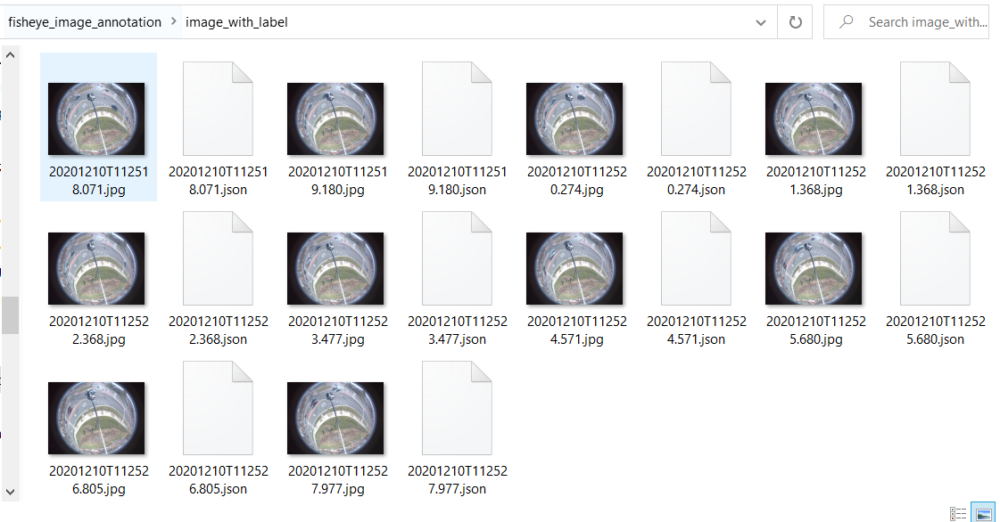

# Fisheye Image Vehicle Annotation Tutorial

[Michigan Traffic Lab, University of Michigan](https://traffic.engin.umich.edu/)

This repo provides a toolbox for image annotation. It also provides a brief tutorial on how to label fisheye traffic images for vehicle detection. This repo is based on [Labelme](https://github.com/wkentaro/labelme), an open source graphical image annotation toolbox.


## Installation

Install [Anaconda](https://www.continuum.io/downloads) first, then run below to install [Labelme](https://github.com/wkentaro/labelme) and [opencv-python](https://pypi.org/project/opencv-python/):

```shell
conda create --name=labelme python=3.6
conda activate labelme
pip install labelme
pip install opencv-python
```
Install git first if it has not been installed. And then clone this repo:

```shell
git clone https://github.com/shengyinshen/fisheye-vehicle-annotation.git 
cd ./fisheye-image-annotation
```

## Usage

### Annotation

Activate anaconda environment and open the Labelme software interface:

```shell
cd ./fisheye-image-annotation
conda activate labelme
labelme --labels labels.txt --nodata --autosave
```

Please follow the steps below to annotate your images.

1. Select your image folder here. By default, the folder should be `./image_with_label`, which contains those images to be annotated.

   

2. Right-click and then select "Create LineStrip"

   

3. Consider each vehicle as a cuboid. Annotate the **bottom rectangle** of each vehicle with three vertices (Apparently, you only need three points instead of four to determine their bottom face). Choose a vehicle type from the drop-down menu ("car", "pickup", "van", "truck", "bus", "motorbike", and "others"). **Any on-road vehicles within the red circle should be annotated**. 

   

4. When you finish labeling all vehicles within the valid area, click "Next Image" to move on to the next. The annotations will be saved automatically. Finally, all the annotations are saved as [JSON](http://www.json.org/) files in the same image directory. The following screenshot shows how your image folders will look like after annotating all images. You can reload them to check whether the annotation looks correct. 

   


## Important things to know

1. Any on-road vehicles within the red circle should be annotated. The vehicles located in parking lots should be ignored, even within the circle. All the vehicles outside the circle should be ignored. 
2. When labeling the bottom rectangle of each vehicle, the order of the three vertices doesn't matter. You may either start from a vehicle's head then goes to its tail, or do it in the opposite way. 
3. If a vehicle is too small, you can use "Ctrl + scroll wheel" to zoom-in and zoom-out.
4. If you accidentally mislabeled any of the vehicles, try right-click --> "Edit Polygons" and "Edit Label" to correct them.
5. Sometimes the bottom vertices may even have the same pixel location. If they do, you can either mark them with the same pixel location or makes a minor shift of your cursor when labeling them. 
6. The category label "others" refers to those special vehicles such as agricultural vehicles, bulldozers, cranes, etc.
7. For those pickup trucks with trailers, they should be separately annotated as two vehilces, i.e., three vertices for each of them. You can select the type of the trailer as "others" since it doesn't belong to any of the rest categories.
8. If you have any further questions, please contact Sean (shengyin@umich.edu) or Zhengxia (zzhengxi@umich.edu).
